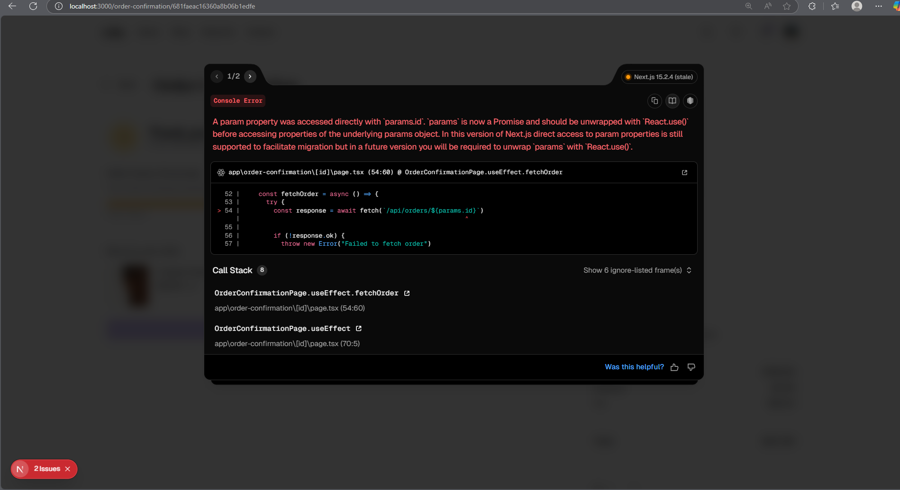

### Recent Error Logs from Main Branch Commits

#### Error Description:
When a user tries to add a new product to the cart through the **detail page**, the following error log is generated:

```plaintext
GET /checkout 200 in 154ms
Error creating order: Error: Order validation failed: items.0.image: Path `image` is required., items.0.product: Path `product` is required.
    at POST (app\api\orders\route.ts:70:12)
  68 |     return NextResponse.json(order, { status: 201 });
  69 |   } catch (error) {
> 70 |     console.error('Error creating order:', error);
     |            ^
  71 |     return NextResponse.json(
  72 |       { error: 'Failed to create order' },
  73 |       { status: 500 } {
  errors: [Object],
  _message: 'Order validation failed'
}
```

#### Observation:
- If the product is added through the **product cards**, no error is generated, and the product is successfully added to the cart.

#### Root Cause:
The error occurs because the `image` and `product` fields are required in the order validation schema, but they are not being provided when creating the order. This issue is likely due to how the product data is being passed from the **detail page** to the order creation function.

#### Suggested Fix:
- Ensure that the `image` and `product` fields are correctly populated when passing product data from the **detail page** to the order creation function.
- Verify the data flow and update the logic to include the required fields before making the API call.



#### Error Description:
after successfull placement of order, the user is redirected to the checkout page. The following error log is generated:

params.id error --> params.id is not used in newer versions of the nextjs using app router.

#### Fix:
add a await before the params.id in the checkout page.
--> something like this it can be solved 
```javascript


admin panel acces using email and and errors

card details